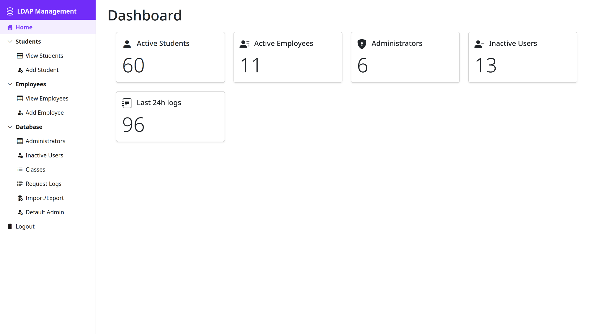
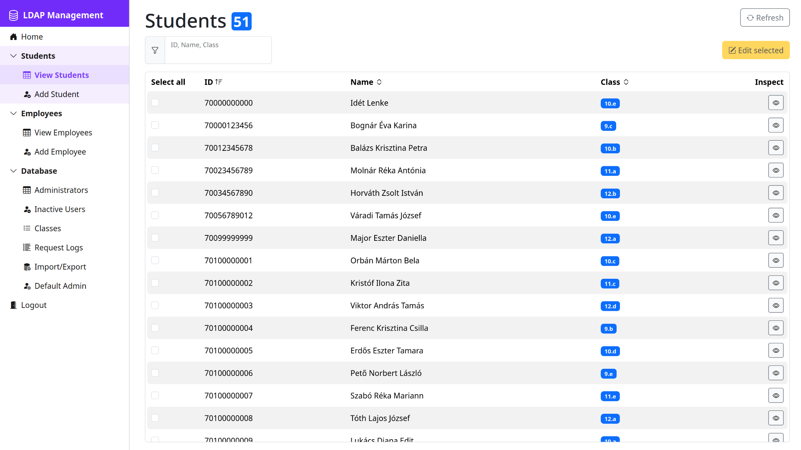
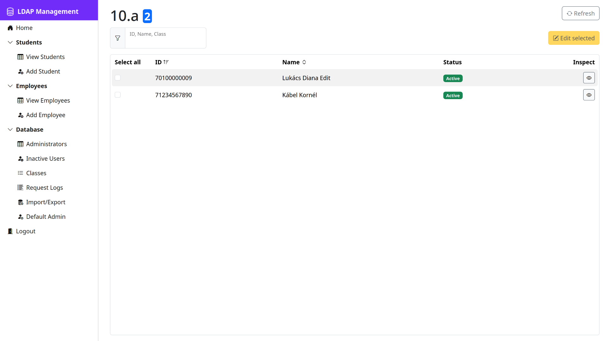
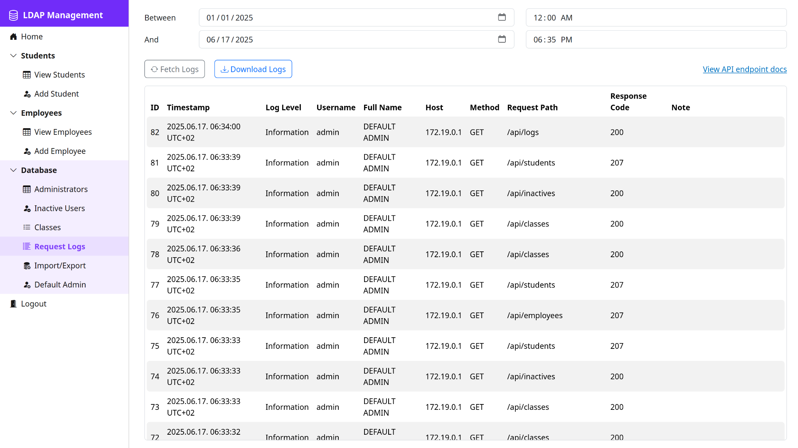
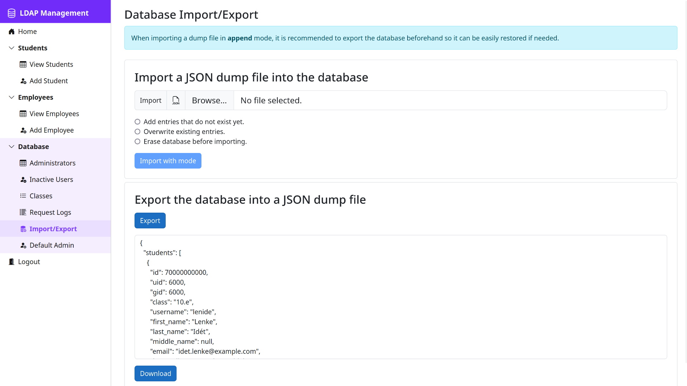

# Neu LDAP Management System

[](https://github.com/NeuSzft/NeuLdapMgnt/actions/workflows/run-tests.yml)


### Table of Contents
- [Neu LDAP Management System](#neu-ldap-management-system)
    - [Table of Contents](#table-of-contents)
  - [Project Summary](#project-summary)
  - [Gallery](#gallery)
  - [Dependencies](#dependencies)
  - [Databases](#databases)
    - [OpenLDAP](#openldap)
    - [PostgreSQL](#postgresql)
  - [Running the Project](#running-the-project)
    - [Crate a *.env* file:](#crate-a-env-file)
    - [Environment variables:](#environment-variables)
    - [Start the services:](#start-the-services)
    - [Stop the services:](#stop-the-services)
    - [Remove the containers:](#remove-the-containers)
  - [Running the Demo](#running-the-demo)
      - [Run this command to start the demo:](#run-this-command-to-start-the-demo)
      - [Run this command to stop the demo:](#run-this-command-to-stop-the-demo)
      - [Run this command to remove the demo containers:](#run-this-command-to-remove-the-demo-containers)
  - [Testing](#testing)
  - [WebApp Manual](#webapp-manual)
  - [API Endpoints](#api-endpoints)
  - [Models shared by the API and WebApp](#models-shared-by-the-api-and-webapp)


## Project Summary
This project aims to make managing the personal information and the credentials of teachers and students easier by providing a web interface and a RESTful API that uses an OpenLDAP database as persistent storage.

The API made using [ASP.NET Core](https://dotnet.microsoft.com/en-us/apps/aspnet) and the frontend is made using [Blazor](https://dotnet.microsoft.com/en-us/apps/aspnet/web-apps/blazor) and is compiled into WebAssembly.\
The project can be deployed as [Docker](https://www.docker.com/) containers.


## Gallery








## Dependencies
- [Docker](https://www.docker.com/)
- [Docker Compose](https://docs.docker.com/compose/)
- [GNU Make](https://www.gnu.org/software/make/)


## Databases

### OpenLDAP
The OpenLDAP database is responsible for storing the teachers and students of the school.
This includes their personal information and credentials. This database is also used for authenticating teachers who are admins, thus have access to the API.

*[Read more about the OpenLDAP database](./docs/OPENLDAP.md)*

### PostgreSQL
The Postgres database is responsible for storing the logs the API creates when it receives incoming requests and the users who have sent the requests.

*[Read more about the Postgres database](./docs/POSTGRES.md)*


## Running the Project

### Crate a *.env* file:
Run this command:
```
make env
```

This will generate a .env that will contain the necessary environment variables. You can edit these if needed.
> If the defaults are okay, then this can be skipped because it is a prerequisite of the `start` target.

### Environment variables:
| Name                   | Default   | Description                                                                                                       |
| :--------------------- | :-------- | :---------------------------------------------------------------------------------------------------------------- |
| LDAP_ORGANIZATION      | Neu       | The name of the organization                                                                                      |
| LDAP_DOMAIN            | neu.local | The name of the LDAP domain                                                                                       |
| LDAP_ADMIN_PASSWORD    | ldappass  | The password of the **admin** LDAP user                                                                           |
| POSTGRES_USER_PASSWORD | postgres  | The password of the **postgres** PostgreSQL user                                                                  |
| DEFAULT_ADMIN_USERNAME | admin     | The username of the default API admin                                                                             |
| DEFAULT_ADMIN_PASSWORD | adminpass | The default password of the default API admin                                                                     |
| LOG_TO_DB              | true      | If `true` the API will log the incoming requests to the Postgres database                                         |
| CHECK_HEADERS_FOR_ADDR | true      | If `true` the API will try to get the address of the client from the **X-Real-IP** or **X-Forwarded-For** headers |
| PORT                   | 80        | The local port to be used by Nginx                                                                                |

### Start the services:
```
make
```
or
```
make start
```

### Stop the services:
```
make stop
```

### Remove the containers:
```
make down
```


## Running the Demo
The demo enables some debugging and testing features and exposes some additional ports for management.

| Port | Service                            |
| :--- | :--------------------------------- |
| 389  | OpenLDAP                           |
| 5000 | API                                |
| 5432 | PostgreSQL                         |
| 8080 | Nginx reverse proxy and web server |
| 8888 | phpLDAPadmin                       |

#### Run this command to start the demo:
```
make demo
```

#### Run this command to stop the demo:
```
make demo-stop
```

#### Run this command to remove the demo containers:
```
make demo-down
```


## Testing
There are three major parts of the that can be tested separately:
- API endpoints and services
- model validation
- functionality of the webapp

> All of these groups of tests run isolated in docker containers.

*[Read more about testing](./docs/TESTING.md)*


## WebApp Manual
Information about using the web application can be found [here](./docs/USERMANUAL.md).


## API Endpoints
The documentation of the endpoints can be accessed by navigating to the `/api/docs` page of the deployed project.


## Models shared by the API and WebApp
These models are used for communication between the API and the WebApp. A list of them can be found [here](./docs/MODELS.md).
